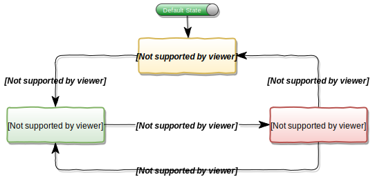

[](LICENSE)
[](https://github.com/VPavlusha/FSM/actions/workflows/cmake.yml)
[](https://github.com/VPavlusha/FSM/actions/workflows/cpp-linter.yml)
[](https://github.com/VPavlusha/FSM/releases)
---

# FSM - Finite State Machine
A static (no dynamic allocations) Finite State Machine (FSM) C/C++ library.<br/>
Based on: https://github.com/AstarLight/FSM-framework

#### Table of Contents  
&emsp;[1. Features](#1-features)  
&emsp;[2. State Transition Table](#2-state-transition-table)  
&emsp;[3. Basic Usage in C](#3-basic-usage-in-c)  
&emsp;[4. Basic Usage in C++](#4-basic-usage-in-c)  
&emsp;[5. Examples](#5-examples)  
&emsp;[6. Requirement](#6-requirement)  
&emsp;[7. Build Procedure by CMake (Unix)](#7-build-procedure-by-cmake-unix)  
&emsp;[8. Build Procedure by CMake (Windows)](#8-build-procedure-by-cmake-windows)  
&emsp;[9. Contributing](#9-contributing)  
&emsp;[10. License](#10-license)  

## 1. Features
  - **Permissive** MIT License.
  - **C and C++ languages** – state machine is written both in C and C++ languages.
  - **Compact** – consumes a minimum amount of resources.
  - **Fully static** – no dynamic memory allocations.
  - **Objects** – support multiple FSM instantiations of a single state machine type.
  - **Transition table** – transition table precisely controls state transition behavior.
  - **Event** – every event is a separate function.
  - **State action** – every state action is a separate function.
  - **Error checking** – runtime checks catch mistakes early.

## 2. State Transition Table


The state diagram shown in the figure can be described via a state transition table. This table has four columns and as many rows as needed. Each row describes a transition from the **Present State** to the **Next State**. The transition is triggered by the **Event** (a combination of one or more event flags). The **Action** describes all the actions associated with the transition.
| Present State | Event | Action | Next State |
|:-------------:|:-----:|:------:|:----------:|
| STATE_0 | IsEvent_1 | Action_1 | STATE_1 |
| STATE_1 | IsEvent_2 | Action_2 | STATE_2 |
| STATE_2 | IsEvent_0 | Action_0 | STATE_0 |
| STATE_2 | IsEvent_1 | Action_1 | STATE_1 |

## 3. Basic Usage in C
```C
// 1. Include FSM header:
#include "finite_state_machine.h"

// 2. Create enumeration for FSM states:
enum FSM_States {
    STATE_0,
    STATE_1,
    STATE_2,
};

// 3. Create Event functions:
bool IsEvent_0(void) {...}
bool IsEvent_1(void) {...}
bool IsEvent_2(void) {...}

// 3. Create Action functions:
void Action_0(void) {...}
void Action_1(void) {...}
void Action_2(void) {...}

// 4. Create FSM Transition table:
static const FSM_TableRow_t kFsmTable[] = {
// | Present state | Event | Action | Next state |
    {STATE_0, IsEvent_1, Action_1, STATE_1},
    {STATE_1, IsEvent_2, Action_2, STATE_2},
    {STATE_2, IsEvent_0, Action_0, STATE_0},
    {STATE_2, IsEvent_1, Action_1, STATE_1},
};

int main()
{
    // 5. Instantiate and initialize FSM:
    FSM_t fsm = {kFsmTable, sizeof(kFsmTable), STATE_0};

    while (true) {
        // 6. Handle FSM instance:
        FSM_ReturnCode_t status_code = FSM_Kernel(&fsm);  // FSM kernel task running on background
        
        if (status_code != FSM_SUCCESS) {
            return EXIT_FAILURE;
        }

        // You can insert some time delay here
    }

    return EXIT_SUCCESS;
}
```

## 4. Basic Usage in C++
```C
// 1. Include FSM header:
#include "finite_state_machine.hpp"

// 2. Create enumeration for FSM states:
enum FSM_States: int {
    STATE_0,
    STATE_1,
    STATE_2,
};

// 3. Create Event functions:
bool IsEvent_0(void) {...}
bool IsEvent_1(void) {...}
bool IsEvent_2(void) {...}

// 3. Create Action functions:
void Action_0(void) {...}
void Action_1(void) {...}
void Action_2(void) {...}

// 4. Create FSM Transition table:
static constexpr fsm::FSM_TableRow_t kFsmTable[] = {
// | Present state | Event | Action | Next state |
    {FSM_States::STATE_0, IsEvent_1, Action_1, FSM_States::STATE_1},
    {FSM_States::STATE_1, IsEvent_2, Action_2, FSM_States::STATE_2},
    {FSM_States::STATE_2, IsEvent_0, Action_0, FSM_States::STATE_0},
    {FSM_States::STATE_2, IsEvent_1, Action_1, FSM_States::STATE_1},
};

int main()
{
    // 5. Instantiate and initialize FSM:
    fsm::FSM fsm(kFsmTable, sizeof(kFsmTable), FSM_States::STATE_0);

    while (true) {
        // 6. Handle FSM instance:
        fsm::FSM_ReturnCode_t status_code = fsm.FSM_Kernel();  // FSM kernel task running on background
        
        if (status_code != fsm::FSM_SUCCESS) {
            return EXIT_FAILURE;
        }

        // You can insert some time delay here
    }

    return EXIT_SUCCESS;
}
```

## 5. Examples
This project includes several [examples](https://github.com/VPavlusha/FSM/tree/main/examples) that showcase the functionality of the FSM library. These examples provide a practical demonstration of how to use the FSM API to implement finite state machines in your own applications.

## 6. Requirement
For the build process:
  - **cmake**
  - **make**
  - **gcc**

For the documentation generation:
  - **doxygen**

## 7. Build Procedure by CMake (Unix)
```
git clone https://github.com/VPavlusha/FSM.git
cd fsm
mkdir build && cd build
cmake ..  # Default to Unix Makefiles
make
```
Once this completes, everything will be under **`build/`**:
  - **fsm_example_c**
  - **fsm_example_cpp**

Run these files to try how FSM works.

## 8. Build Procedure by CMake (Windows)
```
git clone https://github.com/VPavlusha/FSM.git
cd fsm
mkdir build && cd build
cmake .. -G "Unix Makefiles"  # Or use any generator you want to use. Run cmake --help for a list
make
```
Once this completes, everything will be under **`build/`**:
  - **fsm_example_c.exe**
  - **fsm_example_cpp.exe**

Run these files to try how FSM works.

## 9. Contributing
Contributions to the FSM project are welcome. If you find a bug or have a feature request, please submit an issue on the project's GitHub page. If you'd like to contribute code, please submit a pull request.

## 10. License
The FSM project is licensed under the MIT License. See the [MIT license] file for more information.
  
  [MIT license]: http://www.opensource.org/licenses/mit-license.html
